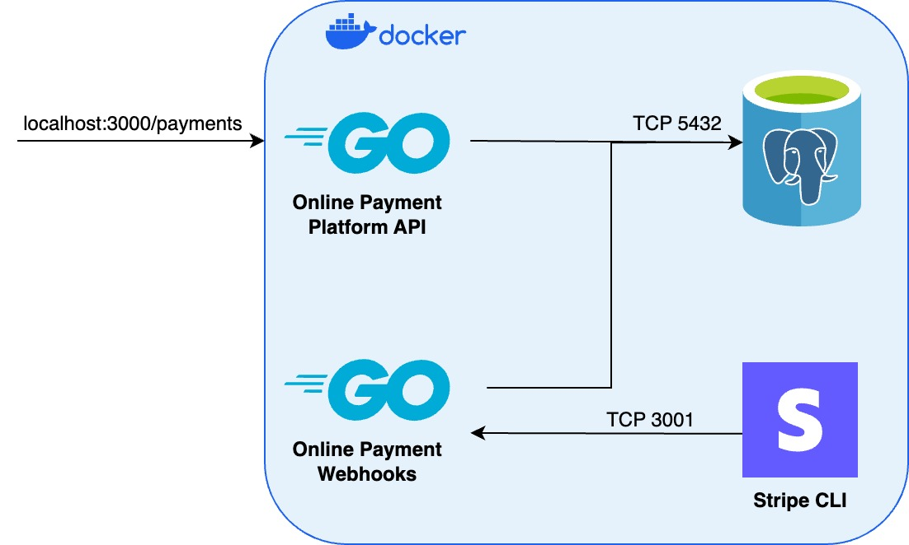

# Simple Online Payment Platform

API to create, query and refund payments processed through a bank simulation powered by Stripe.

## Architecture

The architecture is orchestrated using Docker Compose, which has the following components:

- **Online Payment Platform API**. API service used to create, query and refund payments through a bank simulator.

- **Online Payment Webhooks**. Webhoook handling service dedicated to listen for incoming events and update the status from actions performed using the _Online Payment Platform API_, such as creating or refunding a transaction.

- **PostgreSQL**. Database service used to persist transactions created through the platform.

- **Stripe CLI**. External service used as a _bank simulator_ to handle successful/unsuccessful purchases as well as refunds. This project takes advantage of Stripe's `Test mode` as a way to mock payments and refunds.

### Diagram



## API resources

For more information about the API resources supported by this service, click [here](./api_resources.md).

## Getting Started

Follow these instructions in order to be able to run the project locally or through a containerized environment.

### Prerequisites

#### Stripe

1. Create an account in order to take advantage of `Test mode`, click [here](https://dashboard.stripe.com/login).
2. In case you want to run the project locally, follow this [guide](https://stripe.com/docs/stripe-cli) to install and log into Stripe CLI.

#### Docker & Docker Compose

1. Follow the instructions found in the [official docs](https://docs.docker.com/get-docker/) to install Docker.
2. After installing Docker, follow the steps found in the [official docs](https://docs.docker.com/compose/install/) to install Docker Compose.

#### PostgreSQL (Optional)

In case you are interested in local development, follow these steps to install PostgreSQL:

1. Install PostgreSQL [here](https://www.postgresql.org/download/), depending on your OS.
2. Access PostgreSQL through the terminal using the default user: `psql postgres`.
3. Create the database for the platform and access it:

```sql
CREATE DATABASE payment_platform;

\c payment_platform;
```

4. Create the `transactions_history` table:

```sql
CREATE TABLE IF NOT EXISTS transactions_history (
  transaction_id VARCHAR PRIMARY KEY,
  status VARCHAR(20) NOT NULL,
  failure_reason VARCHAR(50),
  payment_provider VARCHAR(20) NOT NULL,
  description VARCHAR(100) NOT NULL,
  amount NUMERIC NOT NULL,
  currency CHAR(3) NOT NULL,
  type VARCHAR(10) NOT NULL,
  additional_fields JSONB
);
```

#### Golang

In case you are interested in local development, make sure to install the latest version of Golang found on the [official docs](https://go.dev/doc/install).

### Installing

Once you have installed the prerequisites above, run this command to get a copy of the project:

```git
git clone https://github.com/aledeltoro/simple-online-payment-platform.git
```

#### Environment Variables

Create a `.env` file at the root of the project based on the `.env.example` file in the repo. After that, fill in the missing environment variables, which are:

- **STRIPE_SECRET_KEY**. Get the `Test mode` secret key from Stripe's dashboard [here](https://dashboard.stripe.com/test/apikeys).
- **STRIPE_WEBHOOK_SECRET_KEY**. Get the `Test mode` webhook secret key from the code example generated by Stripe in their dashboard. Click [here](https://dashboard.stripe.com/test/webhooks/create?endpoint_location=local).

#### Development

In case you want to start local development, follow theses steps:

1. Install Go dependencies: `go mod download`
2. Depending on the service you want to run (i.e., API, Webhooks or both), use the following commad: `go run cmd/{executable_name}/main.go`

## Running tests

In order to run the tests, run the following command at the root of the project:

```go
go test ./...
```

## Usage

In order to start the services composing the platform, run the following command at the root of the project:

```docker
docker-compose up --build
```

### Testing using Stripe

In order to create successful or unsucessful payments, we must use the test cards provided by Stripe's `Test mode`:

- Examples of test cards to perform succesful payments: `pm_card_visa`, `pm_card_mastercard_debit`. For more examples, click [here](https://stripe.com/docs/testing?testing-method=payment-methods#cards).

- Examples of test cards to perform unsuccesful payments: `pm_card_visa_chargeDeclined`, `pm_card_visa_chargeDeclinedInsufficientFunds`. For more examples, click [here](https://stripe.com/docs/testing?testing-method=payment-methods#declined-payments).

## Built With

- [Chi](https://github.com/go-chi/chi) - Lightweight, idiomatic and composable router for building Go HTTP services.
- [Stripe-go](https://github.com/stripe/stripe-go) - Go library for the Stripe API.
- [Pgx](https://github.com/jackc/pgx) - PostgreSQL driver and toolkit for Go.
- [Pgxmock](https://github.com/pashagolub/pgxmock) - Pgx mock driver for golang to test database interactions.
- [Testify](https://github.com/stretchr/testify) - A toolkit with common assertions and mocks that plays nicely with the standard library.
- [Godotenv](https://github.com/joho/godotenv) - Loads environment variables from `.env`.
